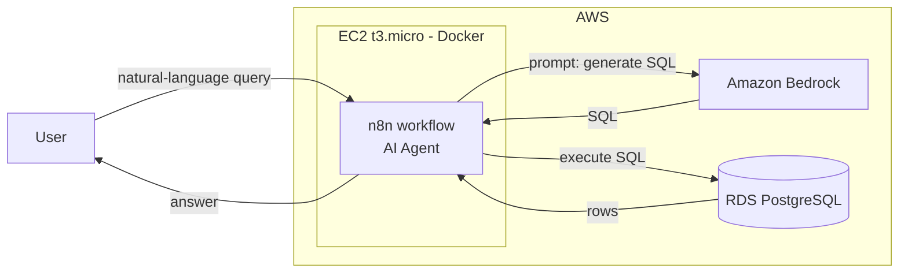

# ai-agent-n8n-rds-database-management
[README.md](https://github.com/user-attachments/files/33011370/README.md)
# AI Agent for Database Management with n8n, Amazon Bedrock & RDS PostgreSQL

An AI agent that lets users query and manage a PostgreSQL database in plain language. The agent runs as an **n8n** workflow hosted on **EC2** (Docker). It uses **Amazon Bedrock** to turn natural-language requests into SQL, then executes the SQL on **Amazon RDS (PostgreSQL)** and returns the result to the user.

> Hands-on project built while practicing on a Whizlabs lab. The implementation notes, configuration and results in this repo are my own.

## Architecture



See [docs/architecture.md](docs/architecture.md) for the flow in detail.

## Tech stack

- AWS: EC2, RDS (PostgreSQL), Amazon Bedrock, IAM, VPC / Security Groups
- n8n (self-hosted with Docker)
- Docker & Docker Compose
- PostgreSQL

## Project structure

```
.
├── docker-compose.yml     # n8n container definition
├── .env.example           # environment variables (copy to .env)
├── workflows/             # exported n8n workflow JSON (no credentials)
├── sql/                   # sample schema
└── docs/
    └── architecture.md
```

## Deployment steps

1. **RDS PostgreSQL**: create the instance, put it in a Security Group that allows port 5432 **only from the EC2 instance's Security Group**.
2. **EC2**: launch a t3.micro instance, install Docker and Docker Compose.
3. **n8n**: copy `.env.example` to `.env`, fill in values, then run `docker compose up -d`.
4. **Workflow**: import `workflows/` into n8n, then add credentials for PostgreSQL (RDS) and AWS Bedrock inside n8n.
5. **Test**: send a natural-language request and check the SQL generated and the result returned.

## Example requests and results

<!-- TODO: add 2-3 real examples from your lab, with screenshots in docs/screenshots/ -->

| Request | Generated SQL | Result |
|---|---|---|
| _TODO_ | _TODO_ | _TODO_ |

## Security considerations

- No credentials are stored in this repo; use `.env` (git-ignored) and n8n's credential store.
- RDS is not publicly accessible; only the n8n host can reach it.
- The IAM identity used by n8n should have least-privilege access to Bedrock only.
- An LLM that writes SQL can generate destructive queries: use a DB user with limited rights (see Improvements).

## Improvements (my additions)

- [ ] Use a read-only database user for the agent, with a separate approval step for write operations
- [ ] Validate generated SQL (block `DROP`, `TRUNCATE`, `DELETE` without `WHERE`)
- [ ] Put n8n behind HTTPS (ALB or reverse proxy)
- [ ] Infrastructure as code (CloudFormation or Terraform)
- [ ] Log queries to CloudWatch

## Lessons learned

<!-- TODO: 3-4 points about what you learned or the problems you solved -->

## Author

Kenza Behlouli - [GitHub](https://github.com/Kenza-BHL)
